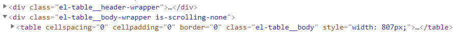
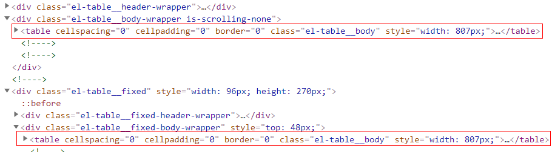
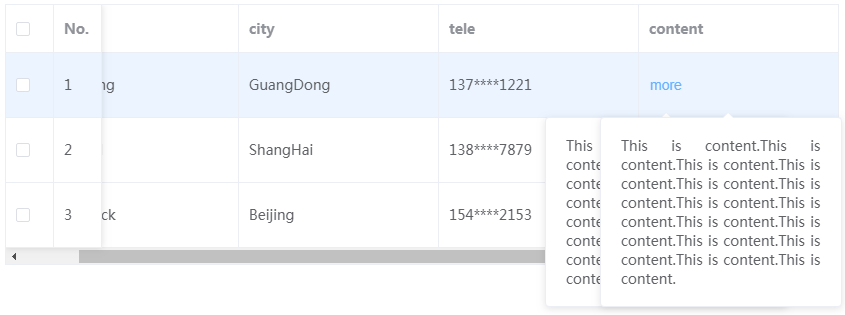

# el-table组件列固定时存在的问题

开发过程中，用到el-table的频次较多，遇到问题的几率比较大。比如：

### 问题描述

单元格内容变化导致行高发生变化时，出现行错位现象。


content列单元格内为折叠面板，多选列和编号列被固定。当折叠面板展开的时候，出现行错位现象。这里的折叠面板仅仅是个例子，错位现象基本发生在能使行高发生变化的组件上。当然，并非能使行高发生变化的组件都会出现行错位，比如通过v-model绑定的v-model，编辑过程中行高发生变化，但并没有出现错位现象。


### 原因分析

如果没有列固定，表格一切正常。


先从DOM元素入手，分别检查表格错位的原因。

**没有列固定时：**



**列固定时：**



显然，这与列固定的实现有关。相比较之下，列固定时，多了`el-table__fixed`的元素。`el-table__fixed`内的表格可理解为固定用的表格副本，数据和表现均与原表格相同，唯一不同的是，这个表格副本只显示部分列。el-table通过这种方式来固定某些列数据。折叠面板的操作只影响当前表格的单元格，而固定用的表格则没有捕获到折叠面板展开的消息，无法与原表格进行显示同步，从而出现行错位现象。


### 源码分析

查看el-table的源码，发现固定分两种，默认固定在左边，也可通过设置`fixed="right"`固定在表格右边。

```vue
<template>
<div class="el-table">
     <!--表格-->
	<div class="el-table__header-wrapper"><!----></div>
	<div class="el-table__body-wrapper"><!----></div>
	<div class="el-table__footer-wrapper"><!----></div>
	<!--左固定-->
	<div 
		v-if="fixedColumns.length > 0"
		class="el-table__fixed">
     	<!--表格-->
		<div class="el-table__fixed-header-wrapper"><!----></div>
		<div class="el-table__fixed-body-wrapper"><!----></div>
		<div class="el-table__fixed-footer-wrapper"><!----></div>
	<div>
	<!--右固定-->
	<div 
		v-if="rightFixedColumns.length > 0"
		class="el-table__fixed-right">
        <!--表格-->
		<div class="el-table__fixed-header-wrapper"><!----></div>
		<div class="el-table__fixed-body-wrapper"><!----></div>
		<div class="el-table__fixed-footer-wrapper"><!----></div>
	<div>
</div>
</template>
<script>
    export default {
        computed: {
            fixedColumns() {/*...*/},
            rightFixedColumns() {/*...*/}
        }
    }
</script>
```

比较复杂的情况，表格左右都有固定列。实际上这里多出了两个用于固定的表格，所以出现的错位现象可能更加复杂。这种情况下通过vue-devtool调试也不那么方便，要保证三个表格显示正常，必须使用同一份状态(data)。

### 解决问题

多个表格绑定同一份数据时，不论数据如何变化，都能实现表格同步显示。就折叠面板来说，保证展开折叠状态一致，错位问题即可解决。

理论上，要求表格绑定单一状态，是保证固定列显示正常的条件。但是，有时候也会“翻车”。固定列把表格复制出多份，也就是说，单元格存在popover等弹出框组件时，同一个单元格位置，会有多个弹出框。根据单一状态原则，显示状态为true时，会有多个弹出框同时显示出来：



这种效果能明确证明：左列固定时这里存在两个表格。针对拥有弹出框效果的单元格，同一状态显然不适用，这种时候就应该采取折叠面板的实现方式，保证只触发一个单元格的弹出框效果。

### 总结

综上的问题，归根到底，还是因为固定列的实现方式（多个表格实现固定）导致的问题。行错位的主要原因是表格状态不一致，弹出框的主要原因是表格状态一致，二者看似很矛盾，但前者是横向问题，后者是纵向问题。固定列要求多表格横向对齐，即保证横向状态一致。固定列时，固定的表格与原表格注定无法纵向对齐，因此若存在弹出效果，状态应该停留在单元格内部。


