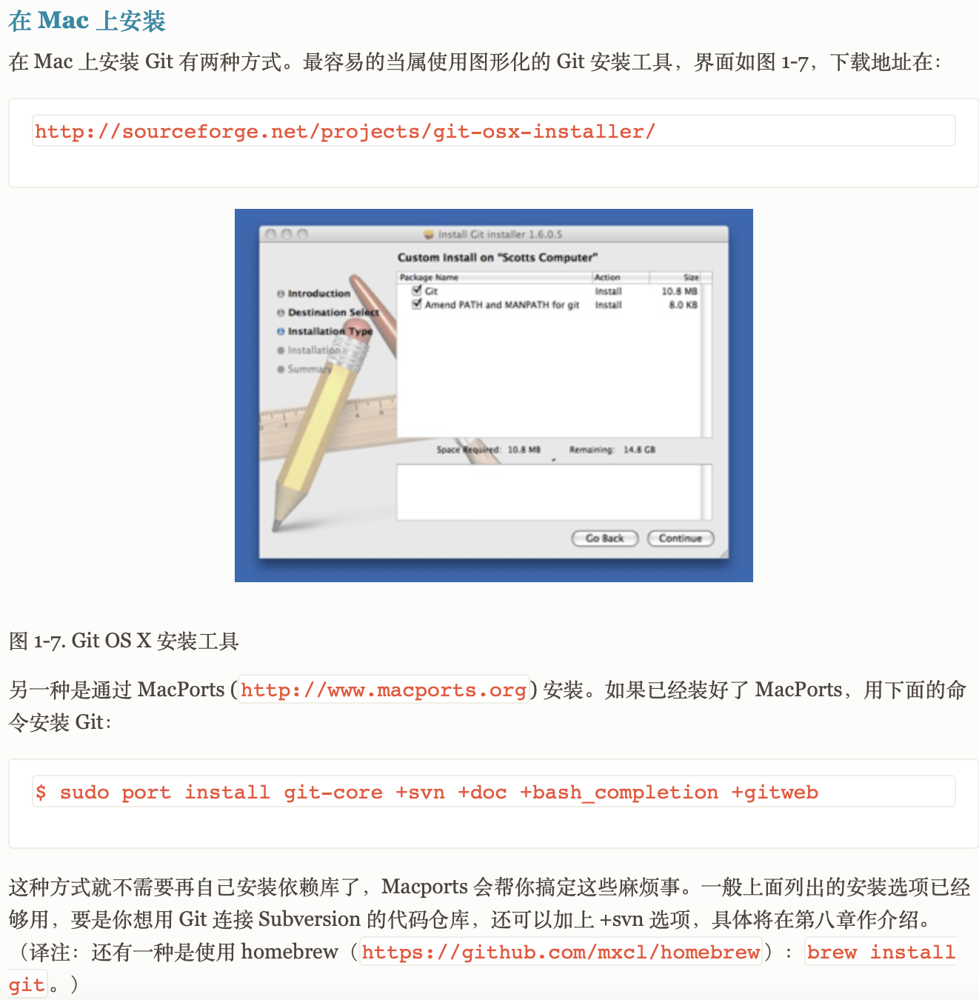
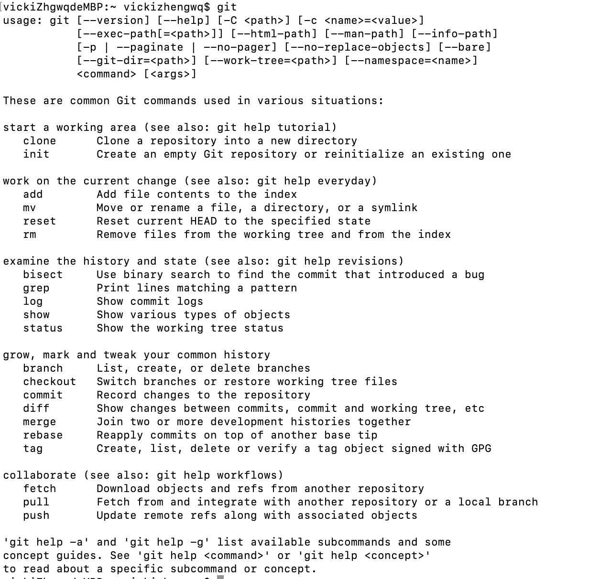
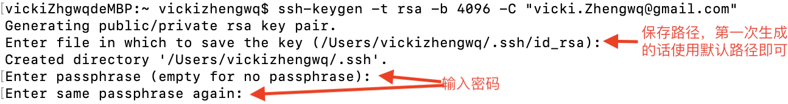
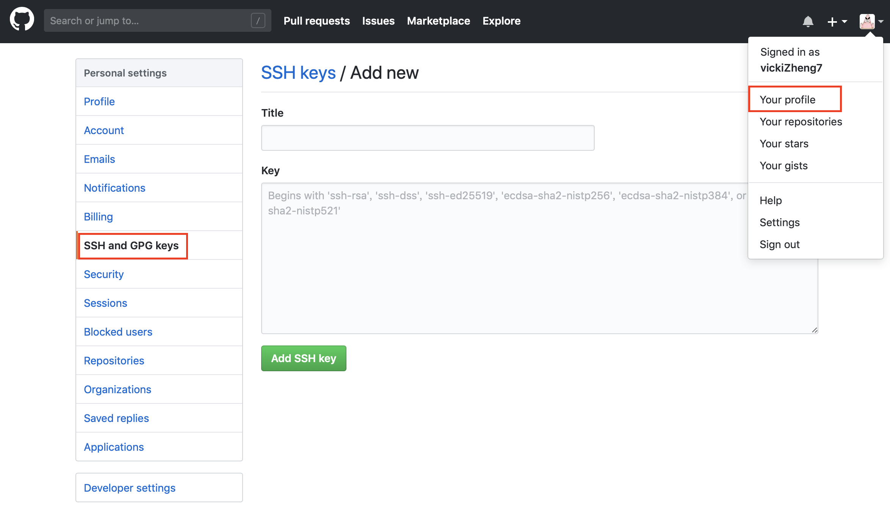
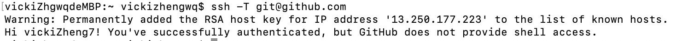
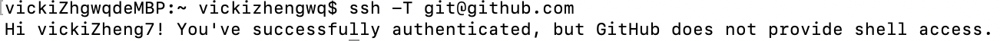

# mac下git的安装及使用

## git的安装
原本，我应该按照以下方式去安装git：

安装之前，检查一下未安装git时提示什么信息，发现git已经安装好了

原来，我之前安装了Xcode，Xcode集成了git，所以不需要另外安装了。

## git配置
首先配置用户信息，这个很重要，因为每次提交代码的时候都会使用这些信息。

检查配置信息：`git config --list`

检查配置的某一项：`git config <key>`，例如`git config user.name`

## 生成ssh key
1.使用github的email生成ssh key

2.检查ssh key

`ls -al ~/.ssh`

3.把ssh key添加到ssh-agent(密钥管理器)

(1)开启密钥管理器：`eval "$(ssh-agent -s)"`

(2)将ssh key交给ssh agent保管：`ssh-add -K ~/.ssh/id_rsa`

4.复制ssh key，并添加到github中

`cat .ssh/id_rsa.pud`

5.验证

`ssh -T git@github.com`

验证成功，但是出现了警告信息，这个警告信息其实不会有什么影响，但是看着很难受，按照警告的要求把它消除掉吧。

`sudo vim /etc/hosts`，然后添加一行`13.250.177.223 github.com`

重新验证一下，问题解决啦。

## 使用

将本地仓库推送到远程github上。

1. 在github上新建一个仓库

2. 初始化本地代码目录作为Git仓库

	`git init`

3. 将当前目录下的所有文件添加到本地仓库中

	`git add .`

4. 提交文件

	`git commit -m "commit message"`

5. 从仓库拷贝新建的仓库地址

6. 添加远程仓库的地址

	`git remote add origin <git address>`

	查看远程仓库地址：`git remote -v`

7. 将本地仓库推送到远程github上

	`git push -u origin master`

	如果提示冲突的话，使用`git push -u origin master -f`强制推送