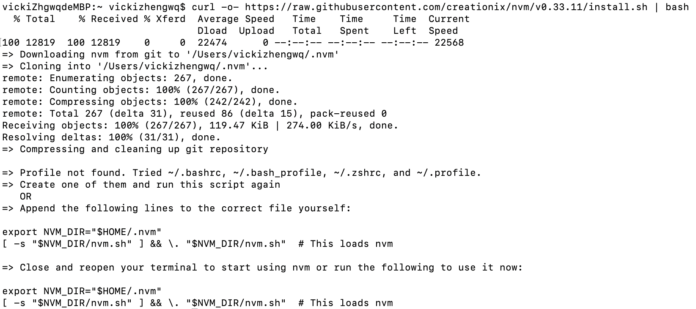
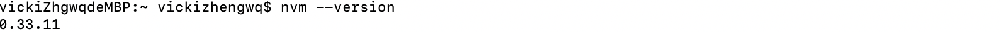

# nvm的安装及使用

## 介绍
近期投入到了另外一个项目中进行并行开发，依据项目要求升级了node版本。但是，给原来的项目添加了依赖包之后，发布到开发环境时在执行机上却出了问题，原因是执行机上的node不支持添加依赖包版本。维护多个版本的node是个很麻烦的问题，直到我发现了[nvm](https://github.com/creationix/nvm)。nvm支持在同一个设备上维护多个node版本。


## 安装
**如果安装了node，请先卸载node，再来安装nvm。**

1.安装或者更新nvm，在终端窗口输入：
`curl -o- https://raw.githubusercontent.com/creationix/nvm/v0.33.11/install.sh | bash`


2.设置环境变量

根据安装之后的提示，设置环境变量，nvm才能正常使用。

```cmd
export NVM_DIR="$HOME/.nvm"
[ -s "$NVM_DIR/nvm.sh" ] && \. "$NVM_DIR/nvm.sh"
```


## 使用
1.安装最新版本的node

`nvm install node`

2.安装指定版本的node

`nvm install 7.7.4`

3.指定使用最新的node版本

`nvm use node`

4.使用指定的node版本

`nvm use 7.7.4`

5.查看可以安装的node版本号

`nvm list-remote` or `nvm ls-remote`

6.查看已安装的node版本

`nvm list` or `nvm ls`