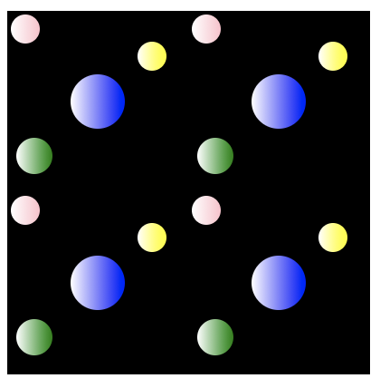
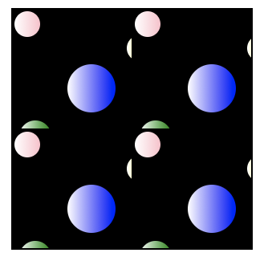
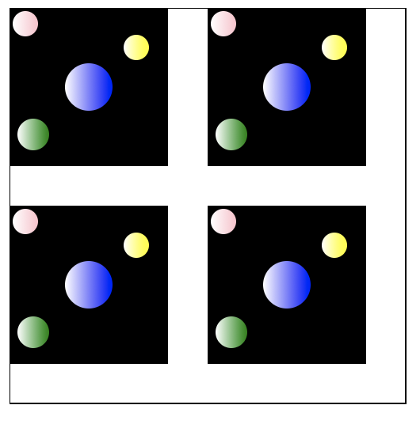
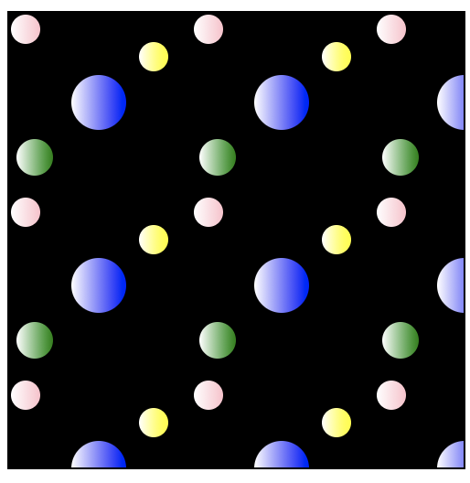
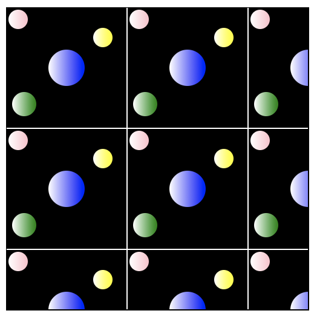
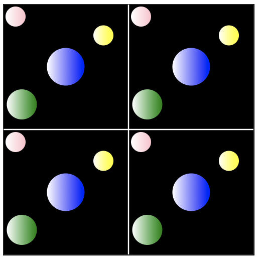

# pattern(图案)

pattern需要在defs内部定义，同样使用填充的方式填充到对象中。

pattern = 任意个基本形状的组合。



```
 <svg width="400" height="400">
	<defs>
		<linearGradient id="pink">
			<stop offset="0%" stop-color="white"></stop>
			<stop offset="100%" stop-color="pink"></stop>
		</linearGradient>
		<linearGradient id="yellow">
			<stop offset="0%" stop-color="white"></stop>
			<stop offset="100%" stop-color="yellow"></stop>
		</linearGradient>
		<linearGradient id="blue">
			<stop offset="0%" stop-color="white"></stop>
			<stop offset="100%" stop-color="blue"></stop>
		</linearGradient>
		<linearGradient id="green">
			<stop offset="0%" stop-color="white"></stop>
			<stop offset="100%" stop-color="green"></stop>
		</linearGradient>
		<pattern id="pattern" x="0" y="0" width="0.5" height="0.5">
			<rect x="0" y="0" width="100" height="100" fill="black"/>
			<circle cx="10" cy="10" r="8" fill="url(#pink)"/>
			<circle cx="50" cy="50" r="15" fill="url(#blue)"/>
			<circle cx="15" cy="80" r="10" fill="url(#green)"/>
			<circle cx="80" cy="25" r="8" fill="url(#yellow)"/>
		</pattern>
	</defs>
	<rect x="0" y="0" width="200" height="200" stroke="black" fill="url(#pattern)"/>
</svg>
```
每个图案宽高均为100\*100，且pattern的宽高均为外部区域的50%，在200\*200的区域内正好重复四次。

#### 如果外部区域宽高发生变化

* 150 \* 150



pattern图案部分被截断，此时给每个图案的有效区域仅有75\*75，不满足100\*100。

* 400 \* 400



pattern图案偏小，此时给每个图案的有效区域仅有200\*200，超出100\*100，部分区域未被填充。

【原因】这跟pattern使用的单元系统有关系，pattern元素的属性**patternUnits**用于定义了pattern的单元系统及其大小，默认值是ObjectBoundingBox，使得x、y、width、height的值均为外部框的百分比。

###### patternUnits
* ObjectBoundingBox：默认值，x、y、width、height的值均为外部框的百分比。
* userSpaceOnUse：x、y、width、height的值对应当前用户的坐标系统的值。

更改patternUnits为userSpaceOnUse，可以使得图案完整填充不留缝隙。



```
<pattern id="pattern" x="0" y="0" width="100" height="100" patternUnits="userSpaceOnUse">
	<rect x="0" y="0" width="100" height="100" fill="black"/>
	<circle cx="10" cy="10" r="8" fill="url(#pink)"/>
	<circle cx="50" cy="50" r="15" fill="url(#blue)"/>
	<circle cx="15" cy="80" r="10" fill="url(#green)"/>
	<circle cx="80" cy="25" r="8" fill="url(#yellow)"/>
</pattern>
```

#### back：如果外部区域宽高发生变化
使用patternUnits属性的userSpaceOnUse，使得图案铺满整个外部区域，给图案加上边框，效果如下：



实际上图案重复了9次，并且其中只有四个图案完整。实际希望的效果是，拉伸图案使其填充完整的同时保证图案完整。patternUnits并不能改变pattern的内容，这里需要调整另外一个属性：**patternContentUnits**。

###### patternContentUnits
与patternUnits相似，patternContentUnits的可选值与patternUnits相同，作用相似。但是，patternContentUnits定义的是pattern内基本元素使用的单元系统，默认值为userSpaceOnUse。

改用userSpaceOnUse属性，使用百分比设置pattern内部形状，使其能够自适应。



```
<pattern id="pattern" x="0" y="0" width="0.5" height="0.5" patternContentUnits="objectBoundingBox">
	<rect x="0" y="0" width="0.5" height="0.5" fill="black" stroke-width="0.005"//>
	<circle cx="0.05" cy="0.05" r="0.04" fill="url(#pink)"/>
 	<circle cx="0.25" cy="0.25" r="0.075" fill="url(#blue)"/>
	<circle cx="0.075" cy="0.4" r="0.06" fill="url(#green)"/>
	<circle cx="0.4" cy="0.125" r="0.04" fill="url(#yellow)"/>
</pattern>
```
