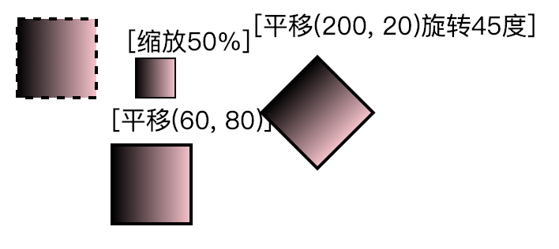

# 基础变形(transform)

把属性赋给一整个元素集合，需要使用g元素。

```
<g fill="pink">
	<rect x="0" y="0" width="100" height="100" fill="black"/>
	<rect x="110" y="0" width="100" height="100"/>
</g>
```
g元素内(未指定填充颜色的)形状集合全部使用pink填充，优先使用元素的fill属性，如果有的话。

接下来所有的变形都会使用到transform属性。



### 平移
```
<rect x="10" y="10" width="50" height="50" transform="translate(60, 80)"/>
```
### 旋转
```
<rect x="10" y="10" width="50" height="50" transform="rotate(45)"/>
```
### 缩放
```
<rect x="10" y="10" width="50" height="50" transform="scale(0.5)"/>
```
