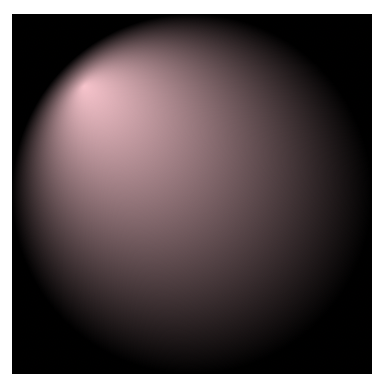

# 渐变

SVG的渐变分两种，第一种是线性渐变，第二种是放射渐变，效果如下：


```
<svg width="200%" height="200%">
	<defs>
		<!--线性渐变-->
		<linearGradient id="linear">
			<stop offset="0%" stop-color="pink"></stop>
			<stop offset="100%" stop-color="black"></stop>
		</linearGradient>
		<!--放射渐变-->
		<radialGradient id="radial">
			<stop offset="0%" stop-color="pink"></stop>
			<stop offset="100%" stop-color="black"></stop>
		</radialGradient>
	</defs>
	<rect x="10" y="10" width="180" height="180" fill="url(#linear)"/>
    <rect x="210" y="10" width="180" height="180" fill="url(#radial)"/>
</svg>
```

在defs元素中定义好渐变元素，然后填充到图形中。

## 基本渐变效果

渐变元素内部有几个stop元素，这些元素通过offset(偏移)指定stop-color(颜色中值)的特性位置，非特性位置的区间则根据相邻的颜色实现颜色渐变的效果。你还可以通过stop-opacity来设置当前位置颜色的透明度。

## 变换渐变效果

#### 线性渐变方向

基本线性渐变，颜色从左到右(横向)发生线性变化。如果你想改变线性渐变的方向，可以通过两个点[(x1, y1), (x2, y2)]来控制。两个点连成一条直线，直线的方向即为线性渐变的新方向。效果如下：


```
<linearGradient id="linear1" xlink:href="#linear" x1="0" y1="0" x2="1" y2="1"/>
```

#### 放射渐变

放射渐变效果由渐变中心和焦点控制。

**【怎么区分中心和焦点？】**

（1）放射渐变效果存在于一个圆形区域内，这个区域的中心点就是渐变中心，可通过(cx, cy)来控制渐变中心的位置，还可通过r属性改变渐变效果的范围(半径)。

（2）这个圆形区域内密度最集中的点，即为渐变焦点，可通过(fx, fy)改变焦点。

普通放射效果如下：


不改变中心，调整焦点位置为(0.2, 0.2)，效果如下：
```
<radialGradient id="radial1" xlink:href="#radial" fx="0.2" fy="0.2"/>
```



不改变焦点，调整中心位置为(0.2, 0.2)，效果如下：
```
<radialGradient id="radial1" xlink:href="#radial" cx="0.2" cy="0.2"/>
```


**中心的改变影响了放射区域的位置和范围，焦点的改变影响了放射区域内部的放射效果。**

### spreadMethod属性

`<radialGradient id="radial5" xlink:href="#radial" spreadMethod="pad" fx="0.25" fy="0.25" r="0.4"/>`

当对象没有被完全填充时，超出的部分由该属性指定使用什么方式填充。它有三个值：

* pad：默认值，使用**最终颜色**填充超出的部分。。


* repeat：以**重复**的方式填充超出的部分。


* reflect：与原先的渐变正好相反，以**镜像**的方式填充超出的部分。


**不过要注意，这个属性在safari浏览器中不生效。**


